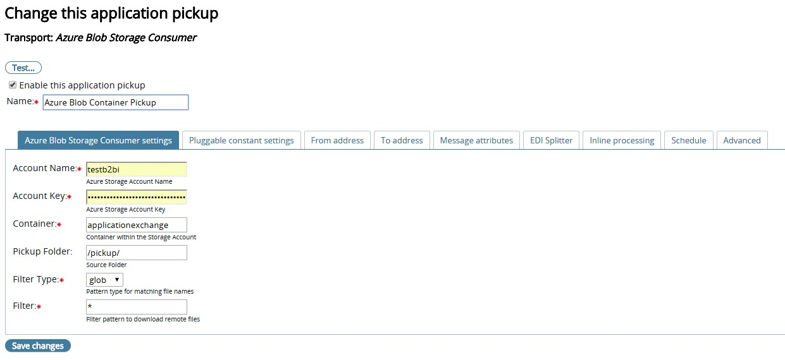

## Azure Blob Storage plugin with Application pickup, and Delivery
* Download PluggableTransport  and extract the contents to ```{B2BI_INSTALL_HOME}/Interchange/site/jars``` to each of the B2Bi cluster nodes.
* Adjust pluggabletransports.xml under ```{B2BI_INSTALL_HOME}/Interchange/conf``` with the xml content from 
* Bounce Trading Engine on all cluster nodes
* Source can be viewed 
  * If you are building on your local laptop, add a lib folder to the project and include ```interchange-server.jar``` and other dependencies. Refer gradle build script for more details
* The plugin is not tested, and is built as an exercise. Please use it with proper discretion. Feel free to submit a pull request.

### Sample screenshots

#### Sample Application Pickup Configuration



#### Sample Application Delivery Configuration

