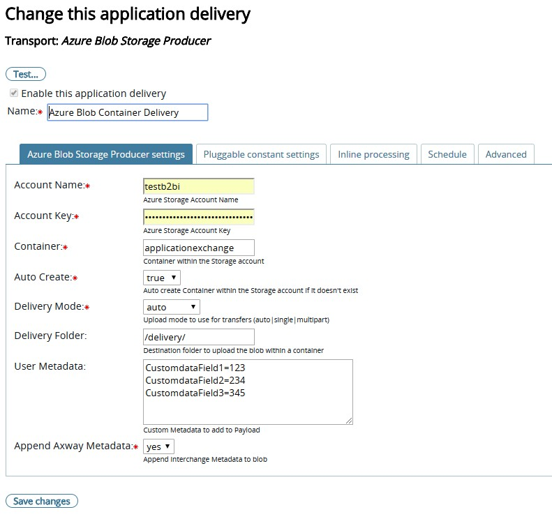

## Azure Blob Storage plugin with Application pickup, and Delivery
* Download PluggableTransport [here](distributions)
  * Formats available [tar](distributions/b2b-azure-plugin.tar), [zip](distributions/b2b-azure-plugin.zip)
* Extract the contents of the tar/zip file to ```{B2BI_INSTALL_HOME}/Interchange/site/jars``` on each of the B2Bi cluster nodes.
  * NOTE: All the libraries referenced by the plugin are included in the tar/zip file.
* Update the ```{B2BI_INSTALL_HOME}/Interchange/conf/pluggabletransports.xml``` configuration file with [azure-pluggabletransports.xml](distributions/azure-pluggabletransport.xml)
  * NOTE: A constant setting with the name 'Exchange type' is used to determine whether the plugin is used for Pickup/Delivery.
* Bounce Trading Engine on all the B2Bi nodes (if using in clustered mode)
* Source can be viewed [here](https://github.com/cmanda/axway-b2b-plugins/tree/master/b2b-azure-plugin)
  * If you are building on your local developer environment, add a ```lib``` folder to the project and include ```interchange-server.jar``` and other relevant dependencies. Refer gradle build script for more details
* The plugin is tested minimally, and is built as an exercise. Please use it with proper discretion. Feel free to submit a pull request for any issues/bug fixes/suggestions.

### Sample screenshots

#### Sample Application Pickup Configuration


#### Sample Application Delivery Configuration

